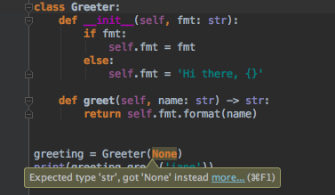
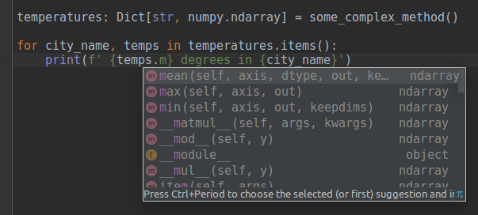

# We made it! 

*Update (Jan 2020)*. 
Python 2 is now officially retired. Thanks to everyone for making this hard transition to better code happen!

# Migrating to Python 3 with pleasure
## A short guide on features of Python 3 for data scientists


Python became a mainstream language for machine learning and other scientific fields that heavily operate with data;
it boasts various deep learning frameworks and well-established set of tools for data processing and visualization.

However, Python ecosystem co-exists in Python 2 and Python 3, and Python 2 is still used among data scientists.
By the end of 2019 the scientific stack will [stop supporting Python2](http://www.python3statement.org).
As for numpy, after 2018 any new feature releases will only support [Python3](https://github.com/numpy/numpy/blob/master/doc/neps/dropping-python2.7-proposal.rst). *Update (Sep 2018): same story now with pandas, matplotlib, ipython, jupyter notebook and jupyter lab.*

To make the transition less frustrating, I've collected a bunch of Python 3 features that you may find useful.


Image from [Dario Bertini post (toptal)](https://www.toptal.com/python/python-3-is-it-worth-the-switch)

## Better paths handling with `pathlib`

`pathlib` is a default module in python3, that helps you to avoid tons of `os.path.join`s:

```python
from pathlib import Path

dataset = 'wiki_images'
datasets_root = Path('/path/to/datasets/')

train_path = datasets_root / dataset / 'train'
test_path = datasets_root / dataset / 'test'

for image_path in train_path.iterdir():
    with image_path.open() as f: # note, open is a method of Path object
        # do something with an image
```

Previously it was always tempting to use string concatenation (concise, but obviously bad),
now with `pathlib` the code is safe, concise, and readable.

Also `pathlib.Path` has a bunch of methods and properties, that every python novice previously had to google:

```python
p.exists()
p.is_dir()
p.parts
p.with_name('sibling.png') # only change the name, but keep the folder
p.with_suffix('.jpg') # only change the extension, but keep the folder and the name
p.chmod(mode)
p.rmdir()
```

`pathlib` should save you lots of time,
please see [docs](https://docs.python.org/3/library/pathlib.html) and [reference](https://pymotw.com/3/pathlib/) for more.


## Type hinting is now part of the language

Example of type hinting in pycharm: <br/>


Python is not just a language for small scripts anymore,
data pipelines these days include numerous steps each involving different frameworks (and sometimes very different logic).

Type hinting was introduced to help with growing complexity of programs, so machines could help with code verification.
Previously different modules used custom ways to point [types in docstrings](https://www.jetbrains.com/help/pycharm/type-hinting-in-pycharm.html#legacy)
(Hint: pycharm can convert old docstrings to fresh type hinting).

As a simple example, the following code may work with different types of data (that's what we like about python data stack).
```python
def repeat_each_entry(data):
    """ Each entry in the data is doubled
    <blah blah nobody reads the documentation till the end>
    """
    index = numpy.repeat(numpy.arange(len(data)), 2)
    return data[index]
```

This code e.g. works for `numpy.array` (incl. multidimensional ones), `astropy.Table` and `astropy.Column`, `bcolz`, `cupy`, `mxnet.ndarray` and others.

This code will work for `pandas.Series`, but in the wrong way:
```python
repeat_each_entry(pandas.Series(data=[0, 1, 2], index=[3, 4, 5])) # returns Series with Nones inside
```

This was two lines of code. Imagine how unpredictable behavior of a complex system, because just one function may misbehave.
Stating explicitly which types a method expects is very helpful in large systems, this will warn you if a function was passed unexpected arguments.

```python
def repeat_each_entry(data: Union[numpy.ndarray, bcolz.carray]):
```

If you have a significant codebase, hinting tools like [MyPy](http://mypy.readthedocs.io) are likely to become part of your continuous integration pipeline.
A webinar ["Putting Type Hints to Work"](https://www.youtube.com/watch?v=JqBCFfiE11g) by Daniel Pyrathon is good for a brief introduction.

Sidenote: unfortunately, hinting is not yet powerful enough to provide fine-grained typing for ndarrays/tensors, but [maybe we'll have it once](https://github.com/numpy/numpy/issues/7370), and this will be a great feature for DS.

## Type hinting → type checking in runtime

By default, function annotations do not influence how your code is working, but merely help you to point code intentions.

However, you can enforce type checking in runtime with tools like ... [enforce](https://github.com/RussBaz/enforce),
this can help you in debugging (there are many cases when type hinting is not working).

```python
@enforce.runtime_validation
def foo(text: str) -> None:
    print(text)

foo('Hi') # ok
foo(5)    # fails


@enforce.runtime_validation
def any2(x: List[bool]) -> bool:
    return any(x)

any ([False, False, True, False]) # True
any2([False, False, True, False]) # True

any (['False']) # True
any2(['False']) # fails

any ([False, None, "", 0]) # False
any2([False, None, "", 0]) # fails

```

## <strike>Other usages of function annotations</strike>

*Update: starting from python 3.7 this behavior was [deprecated](https://www.python.org/dev/peps/pep-0563/#non-typing-usage-of-annotations), and function annotations should be used for type hinting only. Python 4 will not support other usages of annotations.*

As mentioned before, annotations do not influence code execution, but rather provide some meta-information,
and you can use it as you wish.

For instance, measurement units are a common pain in scientific areas, `astropy` package [provides a simple decorator](http://docs.astropy.org/en/stable/units/quantity.html#functions-that-accept-quantities) to control units of input quantities and convert output to required units
```python
# Python 3
from astropy import units as u
@u.quantity_input()
def frequency(speed: u.meter / u.s, wavelength: u.nm) -> u.terahertz:
    return speed / wavelength

frequency(speed=300_000 * u.km / u.s, wavelength=555 * u.nm)
# output: 540.5405405405404 THz, frequency of green visible light
```

If you're processing tabular scientific data in python (not necessarily astronomical), you should give `astropy` a shot.

You can also define your application-specific decorators to perform control / conversion of inputs and output in the same manner.

## Matrix multiplication with @

Let's implement one of the simplest ML models &mdash; a linear regression with l2 regularization (a.k.a. ridge regression):

```python
# l2-regularized linear regression: || AX - y ||^2 + alpha * ||x||^2 -> min

# Python 2
X = np.linalg.inv(np.dot(A.T, A) + alpha * np.eye(A.shape[1])).dot(A.T.dot(y))
# Python 3
X = np.linalg.inv(A.T @ A + alpha * np.eye(A.shape[1])) @ (A.T @ y)
```

The code with `@` becomes more readable and more translatable between deep learning frameworks: same code `X @ W + b[None, :]` for a single layer of perceptron works in `numpy`, `cupy`, `pytorch`, `tensorflow` (and other frameworks that operate with tensors).

## Globbing with `**`

Recursive folder globbing is not easy in Python 2, even though the [glob2](https://github.com/miracle2k/python-glob2) custom module exists that overcomes this. A recursive flag is supported since Python 3.5:

```python
import glob

# Python 2
found_images = (
    glob.glob('/path/*.jpg')
  + glob.glob('/path/*/*.jpg')
  + glob.glob('/path/*/*/*.jpg')
  + glob.glob('/path/*/*/*/*.jpg')
  + glob.glob('/path/*/*/*/*/*.jpg'))

# Python 3
found_images = glob.glob('/path/**/*.jpg', recursive=True)
```

A better option is to use `pathlib` in python3 (minus one import!):
```python
# Python 3
found_images = pathlib.Path('/path/').glob('**/*.jpg')
```
Note: there are [minor differences](https://github.com/arogozhnikov/python3_with_pleasure/issues/16) between `glob.glob`, `Path.glob` and bash globbing.

## Print is a function now

Yes, code now has these annoying parentheses, but there are some advantages:

- simple syntax for using file descriptor:
    ```python
    print >>sys.stderr, "critical error"      # Python 2
    print("critical error", file=sys.stderr)  # Python 3
    ```
- printing tab-aligned tables without `str.join`:
    ```python
    # Python 3
    print(*array, sep='\t')
    print(batch, epoch, loss, accuracy, time, sep='\t')
    ```
- hacky suppressing / redirection of printing output:
    ```python
    # Python 3
    _print = print # store the original print function
    def print(*args, **kargs):
        pass  # do something useful, e.g. store output to some file
    ```
    In jupyter it is desirable to log each output to a separate file (to track what's happening after you got disconnected), so you can override `print` now.

    Below you can see a context manager that temporarily overrides behavior of print:
    ```python
    @contextlib.contextmanager
    def replace_print():
        import builtins
        _print = print # saving old print function
        # or use some other function here
        builtins.print = lambda *args, **kwargs: _print('new printing', *args, **kwargs)
        yield
        builtins.print = _print

    with replace_print():
        <code here will invoke other print function>
    ```
    It is *not* a recommended approach, but a small dirty hack that is now possible.
- `print` can participate in list comprehensions and other language constructs
    ```python
    # Python 3
    result = process(x) if is_valid(x) else print('invalid item: ', x)
    ```


## Underscores in Numeric Literal (Thousands Separator)

[PEP-515](https://www.python.org/dev/peps/pep-0515/ "PEP-515") introduced underscores in Numeric Literals.
In Python3, underscores can be used to group digits visually in integral, floating-point, and complex number literals.

```python
# grouping decimal numbers by thousands
one_million = 1_000_000

# grouping hexadecimal addresses by words
addr = 0xCAFE_F00D

# grouping bits into nibbles in a binary literal
flags = 0b_0011_1111_0100_1110

# same, for string conversions
flags = int('0b_1111_0000', 2)
```

## f-strings for simple and reliable formatting

The default formatting system provides a flexibility that is not required in data experiments.
The resulting code is either too verbose or too fragile towards any changes.

Quite typically data scientists outputs some logging information iteratively in a fixed format.
It is common to have a code like:

```python
# Python 2
print '{batch:3} {epoch:3} / {total_epochs:3}  accuracy: {acc_mean:0.4f}±{acc_std:0.4f} time: {avg_time:3.2f}'.format(
    batch=batch, epoch=epoch, total_epochs=total_epochs,
    acc_mean=numpy.mean(accuracies), acc_std=numpy.std(accuracies),
    avg_time=time / len(data_batch)
)

# Python 2 (too error-prone during fast modifications, please avoid):
print '{:3} {:3} / {:3}  accuracy: {:0.4f}±{:0.4f} time: {:3.2f}'.format(
    batch, epoch, total_epochs, numpy.mean(accuracies), numpy.std(accuracies),
    time / len(data_batch)
)
```

Sample output:
```
120  12 / 300  accuracy: 0.8180±0.4649 time: 56.60
```

**f-strings** aka formatted string literals were introduced in Python 3.6:
```python
# Python 3.6+
print(f'{batch:3} {epoch:3} / {total_epochs:3}  accuracy: {numpy.mean(accuracies):0.4f}±{numpy.std(accuracies):0.4f} time: {time / len(data_batch):3.2f}')
```


## Explicit difference between 'true division' and 'floor division'

For data science this is definitely a handy change 

```python
data = pandas.read_csv('timing.csv')
velocity = data['distance'] / data['time']
```

Results in Python 2 depend on whether 'time' and 'distance' (e.g. measured in meters and seconds) are stored as integers.
In Python 3, the result is correct in both cases, because the result of division is float.

Another case is floor division, which is now an explicit operation:

```python
n_gifts = money // gift_price  # correct for int and float arguments
```

In a nutshell:

```python
>>> from operator import truediv, floordiv
>>> truediv.__doc__, floordiv.__doc__
('truediv(a, b) -- Same as a / b.', 'floordiv(a, b) -- Same as a // b.')
>>> (3 / 2), (3 // 2), (3.0 // 2.0)
(1.5, 1, 1.0)
```

Note, that this applies both to built-in types and to custom types provided by data packages (e.g. `numpy` or `pandas`).


## Strict ordering

```python
# All these comparisons are illegal in Python 3
3 < '3'
2 < None
(3, 4) < (3, None)
(4, 5) < [4, 5]

# False in both Python 2 and Python 3
(4, 5) == [4, 5]
```

- prevents from occasional sorting of instances of different types
  ```python
  sorted([2, '1', 3])  # invalid for Python 3, in Python 2 returns [2, 3, '1']
  ```
- helps to spot some problems that arise when processing raw data

Sidenote: proper check for None is (in both Python versions)
```python
if a is not None:
  pass

if a: # WRONG check for None
  pass
```


## Unicode for NLP

```python
s = '您好'
print(len(s))
print(s[:2])
```
Output:
- Python 2: `6\n��`
- Python 3: `2\n您好`.

```python
x = u'со'
x += 'co' # ok
x += 'со' # fail
```
Python 2 fails, Python 3 works as expected (because I've used russian letters in strings).

In Python 3 `str`s are unicode strings, and it is more convenient for NLP processing of non-english texts.

There are other funny things, for instance:
```python
'a' < type < u'a'  # Python 2: True
'a' < u'a'         # Python 2: False
```

```python
from collections import Counter
Counter('Möbelstück')
```

- Python 2: `Counter({'\xc3': 2, 'b': 1, 'e': 1, 'c': 1, 'k': 1, 'M': 1, 'l': 1, 's': 1, 't': 1, '\xb6': 1, '\xbc': 1})`
- Python 3: `Counter({'M': 1, 'ö': 1, 'b': 1, 'e': 1, 'l': 1, 's': 1, 't': 1, 'ü': 1, 'c': 1, 'k': 1})`

You can handle all of this in Python 2 properly, but Python 3 is more friendly.

## Preserving order of dictionaries and **kwargs

In CPython 3.6+ dicts behave like `OrderedDict` by default (and [this is guaranteed in Python 3.7+](https://stackoverflow.com/questions/39980323/are-dictionaries-ordered-in-python-3-6)).
This preserves order during dict comprehensions (and other operations, e.g. during json serialization/deserialization)

```python
import json
x = {str(i):i for i in range(5)}
json.loads(json.dumps(x))
# Python 2
{u'1': 1, u'0': 0, u'3': 3, u'2': 2, u'4': 4}
# Python 3
{'0': 0, '1': 1, '2': 2, '3': 3, '4': 4}
```

Same applies to `**kwargs` (in Python 3.6+), they're kept in the same order as they appear in parameters.
Order is crucial when it comes to data pipelines, previously we had to write it in a cumbersome manner:
```python
from torch import nn

# Python 2
model = nn.Sequential(OrderedDict([
          ('conv1', nn.Conv2d(1,20,5)),
          ('relu1', nn.ReLU()),
          ('conv2', nn.Conv2d(20,64,5)),
          ('relu2', nn.ReLU())
        ]))

# Python 3.6+, how it *can* be done, not supported right now in pytorch
model = nn.Sequential(
    conv1=nn.Conv2d(1,20,5),
    relu1=nn.ReLU(),
    conv2=nn.Conv2d(20,64,5),
    relu2=nn.ReLU())
)
```

Did you notice? Uniqueness of names is also checked automatically.


## Iterable unpacking

```python
# handy when amount of additional stored info may vary between experiments, but the same code can be used in all cases
model_paramteres, optimizer_parameters, *other_params = load(checkpoint_name)

# picking two last values from a sequence
*prev, next_to_last, last = values_history

# This also works with any iterables, so if you have a function that yields e.g. qualities,
# below is a simple way to take only last two values from a list
*prev, next_to_last, last = iter_train(args)
```

## Default pickle engine provides better compression for arrays

Pickling is a mechanism to pass data between threads / processes, in particular used inside `multiprocessing` package. 

```python
# Python 2
import cPickle as pickle
import numpy
print len(pickle.dumps(numpy.random.normal(size=[1000, 1000])))
# result: 23691675

# Python 3
import pickle
import numpy
len(pickle.dumps(numpy.random.normal(size=[1000, 1000])))
# result: 8000162
```

Three times less space. And it is *much* faster.
Actually similar compression (but not speed) is achievable with `protocol=2` parameter, but developers typically ignore this option (or simply are not aware of it). 

Note: pickle is [not safe](https://docs.python.org/3/library/pickle.html) (and not quite transferrable), so never unpickle data received from an untrusted or unauthenticated source.

## Safer comprehensions

```python
labels = <initial_value>
predictions = [model.predict(data) for data, labels in dataset]

# labels are overwritten in Python 2
# labels are not affected by comprehension in Python 3
```

## Super, simply super()

Python 2 `super(...)` was a frequent source of mistakes in code.

```python
# Python 2
class MySubClass(MySuperClass):
    def __init__(self, name, **options):
        super(MySubClass, self).__init__(name='subclass', **options)

# Python 3
class MySubClass(MySuperClass):
    def __init__(self, name, **options):
        super().__init__(name='subclass', **options)
```

More on `super` and method resolution order on [stackoverflow](https://stackoverflow.com/questions/576169/understanding-python-super-with-init-methods).

## Better IDE suggestions with variable annotations

The most enjoyable thing about programming in languages like Java, C# and alike is that IDE can make very good suggestions,
because type of each identifier is known before executing a program.

In python this is hard to achieve, but annotations will help you
- write your expectations in a clear form
- and get good suggestions from IDE

<br />
This is an example of PyCharm suggestions with variable annotations.
This works even in situations when functions you use are not annotated (e.g. due to backward compatibility).

## Multiple unpacking

Here is how you merge two dicts now:
```python
x = dict(a=1, b=2)
y = dict(b=3, d=4)
# Python 3.5+
z = {**x, **y}
# z = {'a': 1, 'b': 3, 'd': 4}, note that value for `b` is taken from the latter dict.
```

See [this thread at StackOverflow](https://stackoverflow.com/questions/38987/how-to-merge-two-dictionaries-in-a-single-expression) for a comparison with Python 2.

The same approach also works for lists, tuples, and sets (`a`, `b`, `c` are any iterables):
```python
[*a, *b, *c] # list, concatenating
(*a, *b, *c) # tuple, concatenating
{*a, *b, *c} # set, union
```

Functions also [support multiple unpacking](https://docs.python.org/3/whatsnew/3.5.html#whatsnew-pep-448) for `*args` and `**kwargs`:
```python
# Python 3.5+
do_something(**{**default_settings, **custom_settings})

# Also possible, this code also checks there is no intersection between keys of dictionaries
do_something(**first_args, **second_args)
```

## Future-proof APIs with keyword-only arguments

Let's consider this snippet
```python
model = sklearn.svm.SVC(2, 'poly', 2, 4, 0.5)
```
Obviously, an author of this code didn't get the Python style of coding yet (most probably, just jumped from cpp or rust).
Unfortunately, this is not just question of taste, because changing the order of arguments (adding/deleting) in `SVC` will break this code. In particular, `sklearn` does some reordering/renaming from time to time of numerous algorithm parameters to provide consistent API. Each such refactoring may drive to broken code.

In Python 3, library authors may demand explicitly named parameters by using `*`:
```python
class SVC(BaseSVC):
    def __init__(self, *, C=1.0, kernel='rbf', degree=3, gamma='auto', coef0=0.0, ... )
```
- users have to specify names of parameters `sklearn.svm.SVC(C=2, kernel='poly', degree=2, gamma=4, coef0=0.5)` now
- this mechanism provides a great combination of reliability and flexibility of APIs

## Data classes

Python 3.7 introduces data classes, a good replacement for `namedtuple` in most cases.
```python
@dataclass
class Person:
    name: str
    age: int

@dataclass
class Coder(Person):
    preferred_language: str = 'Python 3'
```

`dataclass` decorator takes the job of implementing routine methods for you (initialization, representation, comparison, and hashing when applicable). 
Let's name some features:
- data classes can be both mutable and immutable
- default values for fields are supported
- inheritance
- data classes are still old good classes: you can define new methods and override existing
- post-init processing (e.g. to verify consistency) 

Geir Arne Hjelle gives a good overview of dataclasses [in his post](https://realpython.com/python-data-classes/).


## Customizing access to module attributes

In Python you can control attribute access and hinting with `__getattr__` and `__dir__` for any object. Since python 3.7 you can do it for modules too.

A natural example is implementing a `random` submodule of tensor libraries, which is typically a shortcut to skip initialization and passing of RandomState objects. Here's implementation for numpy:  
```python
# nprandom.py
import numpy
__random_state = numpy.random.RandomState()

def __getattr__(name):
    return getattr(__random_state, name)

def __dir__():
    return dir(__random_state)
    
def seed(seed):
    __random_state = numpy.random.RandomState(seed=seed)
```

One can also mix this way functionalities of different objects/submodules. Compare with tricks in [pytorch](https://github.com/pytorch/pytorch/blob/3ce17bf8f6a2c4239085191ea60d6ee51cd620a5/torch/__init__.py#L253-L256) and [cupy](https://github.com/cupy/cupy/blob/94592ecac8152d5f4a56a129325cc91d184480ad/cupy/random/distributions.py).

Additionally, now one can
- use it for [lazy loading of submodules](https://snarky.ca/lazy-importing-in-python-3-7/). For example, `import tensorflow` takes **~150MB** of RAM is imports all submodules (and dependencies). 
- use this for [deprecations in API](https://www.python.org/dev/peps/pep-0562/)
- introduce runtime routing between submodules

## Built-in breakpoint()

Just write `breakpoint()` in the code to invoke debugger.
```python
# Python 3.7+, not all IDEs support this at the moment
foo()
breakpoint()
bar()
```

For remote debugging you may want to try [combining breakpoint() with `web-pdb`](https://hackernoon.com/python-3-7s-new-builtin-breakpoint-a-quick-tour-4f1aebc444c)


## Minor: constants in `math` module

```python
# Python 3
math.inf # Infinite float
math.nan # not a number

max_quality = -math.inf  # no more magic initial values!

for model in trained_models:
    max_quality = max(max_quality, compute_quality(model, data))
```

## Minor: single integer type

Python 2 provides two basic integer types, which are `int` (64-bit signed integer) and `long` for long arithmetics (quite confusing after C++).

Python 3 has a single type `int`, which incorporates long arithmetics.

Here is how you check that value is integer:

```python
isinstance(x, numbers.Integral) # Python 2, the canonical way
isinstance(x, (long, int))      # Python 2
isinstance(x, int)              # Python 3, easier to remember
```

Update: first check also works for *other integral types*, such as `numpy.int32`, `numpy.int64`, but others don't. So they're not equivalent.


## Other stuff

- `Enum`s are theoretically useful, but
    - string-typing is already widely adopted in the python data stack
    - `Enum`s don't seem to interplay with numpy and categorical from pandas
- coroutines also *sound* very promising for data pipelining (see [slides](http://www.dabeaz.com/coroutines/Coroutines.pdf) by David Beazley), but I don't see their adoption in the wild.
- Python 3 has [stable ABI](https://www.python.org/dev/peps/pep-0384/)
- Python 3 supports unicode identifies (so `ω = Δφ / Δt` is ok), but you'd [better use good old ASCII names](https://stackoverflow.com/a/29855176/498892)
- some libraries e.g. [jupyterhub](https://github.com/jupyterhub/jupyterhub) (jupyter in cloud), django and fresh ipython only support Python 3, so features that sound useless for you are useful for libraries you'll probably want to use once.


### Problems for code migration specific for data science (and how to resolve those)

- support for nested arguments [was dropped](https://www.python.org/dev/peps/pep-3113/)
  ```python
  map(lambda x, (y, z): x, z, dict.items())
  ```

  However, it is still perfectly working with different comprehensions:
  ```python
  {x:z for x, (y, z) in d.items()}
  ```
  In general, comprehensions are also better 'translatable' between Python 2 and 3.

- `map()`, `.keys()`, `.values()`, `.items()`, etc. return iterators, not lists. Main problems with iterators are:
  - no trivial slicing
  - can't be iterated twice

  Almost all of the problems are resolved by converting result to list.

- see [Python FAQ: How do I port to Python 3?](https://eev.ee/blog/2016/07/31/python-faq-how-do-i-port-to-python-3/) when in trouble

### Main problems for teaching machine learning and data science with python

Course authors should spend time in the first lectures to explain what is an iterator,
why it can't be sliced / concatenated / multiplied / iterated twice like a string (and how to deal with it).

I think most course authors would be happy to avoid these details, but now it is hardly possible.

# Conclusion

Python 2 and Python 3 have co-existed for almost 10 years, but we *should* move to Python 3.

Research and production code should become a bit shorter, more readable, and significantly safer after moving to Python 3-only codebase.

Right now most libraries support both Python versions.
And I can't wait for the bright moment when packages drop support for Python 2 and enjoy new language features.

Following migrations are promised to be smoother: ["we will never do this kind of backwards-incompatible change again"](https://snarky.ca/why-python-3-exists/)

### Links

- [Key differences between Python 2.7 and Python 3.x](http://sebastianraschka.com/Articles/2014_python_2_3_key_diff.html)
- [Python FAQ: How do I port to Python 3?](https://eev.ee/blog/2016/07/31/python-faq-how-do-i-port-to-python-3/)
- [10 awesome features of Python that you can't use because you refuse to upgrade to Python 3](http://www.asmeurer.com/python3-presentation/slides.html)
- [Trust me, python 3.3 is better than 2.7 (video)](http://pyvideo.org/pycon-us-2013/python-33-trust-me-its-better-than-27.html)
- [Python 3 for scientists](http://python-3-for-scientists.readthedocs.io/en/latest/)

### License

This text was published by [Alex Rogozhnikov](https://arogozhnikov.github.io/about/) and [contributors](https://github.com/arogozhnikov/python3_with_pleasure/graphs/contributors) under [CC BY-SA 3.0 License](https://creativecommons.org/licenses/by-sa/3.0/) (excluding images).
